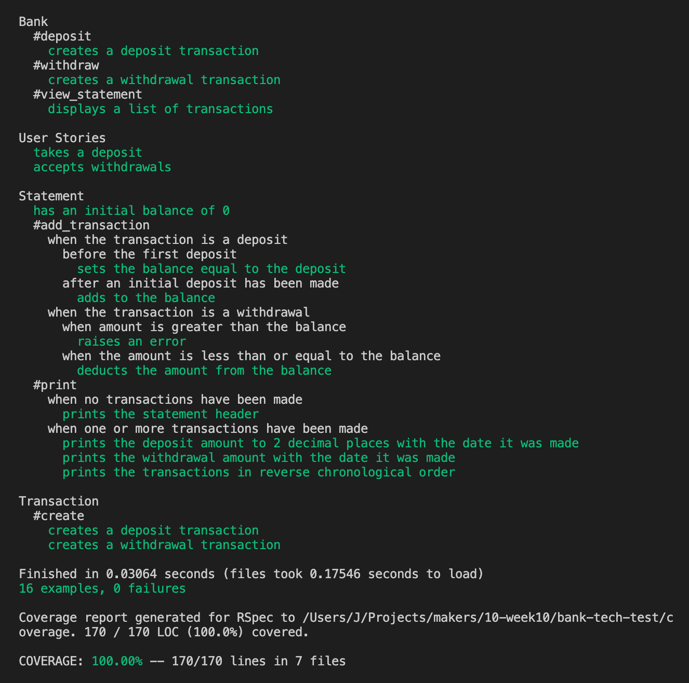

# Bank tech test

A small banking app that lets you make transactions and print them in a statement.

---

## Contents

- [Installation](#install-and-run)<br>
- [Usage](#how-to-use)<br>
- [Running Tests](#how-to-run-tests)<br>
- [Test coverage](#all-tests-pass-with-100-coverage)<br>
- [Specification](#specification)<br>
- [Approach to Task](#approach)<br>
- [Improvements](#improvements)


## Install and run

### Installation

1. Fork and clone this repo
    - `git clone https://github.com/J-son1/bank-tech-test.git`
    - `bundle install`
1. From the command line, start IRB and require 'bank.rb'
    - `irb -r ./lib/bank`

- or...

  - `irb`
  - `require './lib/bank'`

### How to use

##### Example
```irb
3.0.0 :001 > b = Bank.new
 => #<Bank:0x00007fd813942df0 @statement=#<Statement:0x00007fd813942d78 @balance=0, @transactions=[]>> 
3.0.0 :002 > b.deposit(1000)
 => [{:date=>"22/02/2022", :credit=>1000, :debit=>0, :balance=>1000}] 
3.0.0 :003 > b.withdraw(200)
 => [{:date=>"22/02/2022", :credit=>1000, :debit=>0, :balance=>1000}, {:date=>"22/02/2022", :credit=>0, :debit=>200, :balance=>800}] 
3.0.0 :004 > b.deposit(300)
 => [{:date=>"22/02/2022", :credit=>1000, :debit=>0, :balance=>1000}, {:date=>"22/02/2022", :credit=>0, :debit=>200, :balance=>800}, {:date=>"22/02/2022", :credit=>300, :debit=>0, :balance=>1100}] 
3.0.0 :005 > b.view_statement
date || credit || debit || balance
22/02/2022 || 300.00 ||  || 1100.00
22/02/2022 ||  || 200.00 || 800.00
22/02/2022 || 1000.00 ||  || 1000.00
```

##### Methods

- `.deposit()`
- `.withdraw()`
- `.view_statement`

## Test

### How to run tests

1. In the command line, `bundle install` if you haven't already.

1. run `rspec` in project root.

#### All tests pass with 100% coverage.



##### Dependencies

The dependencies used in this app where predominantly for testing.
It uses `rspec` for testing, `simplecov` for test coverage and `simplecov-console` for formatting test coverage output.

---

## Specification

### Requirements

- You should be able to interact with your code via a REPL like IRB or Node. (You don't need to implement a command line interface that takes input from STDIN.)
- Deposits, withdrawal.
- Account statement (date, amount, balance) printing.
- Data can be kept in memory (it doesn't need to be stored to a database or anything).

### Acceptance criteria

Given a client makes a deposit of 1000 on 10-01-2023<br>
And a deposit of 2000 on 13-01-2023<br>
And a withdrawal of 500 on 14-01-2023<br>
When she prints her bank statement<br>
Then she would see:

```
date || credit || debit || balance
14/01/2023 || || 500.00 || 2500.00
13/01/2023 || 2000.00 || || 3000.00
10/01/2023 || 1000.00 || || 1000.00
```

---

## Approach

- My aim was to create efficient, readable code that met the requirements.
- I started with writing the necessary user stories, which I broke broke down into sub requirements where needed.
- A domain model was extracted from the user stories to help to get an idea about the structure of the code.
- I decided to start with one class and then extract classes out from there when needed. This was done in order to not create unnecessary classes.
- After thinking that two classes would be enough (Bank, Statement), I decided to extract a third, which was the Transaction class, to better separate out responsibilities.

## Improvements

- Account for more edge cases.
- Further refactor code for potential future customisation.
- Format statement output to be more readable.
